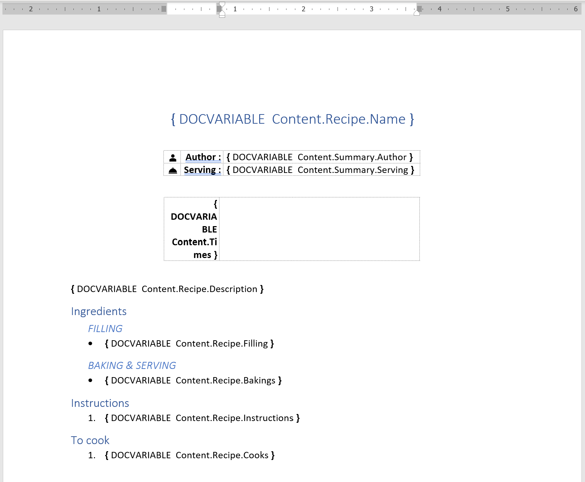
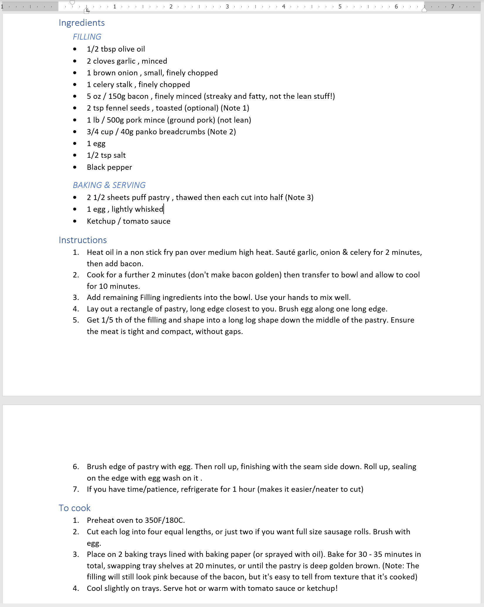
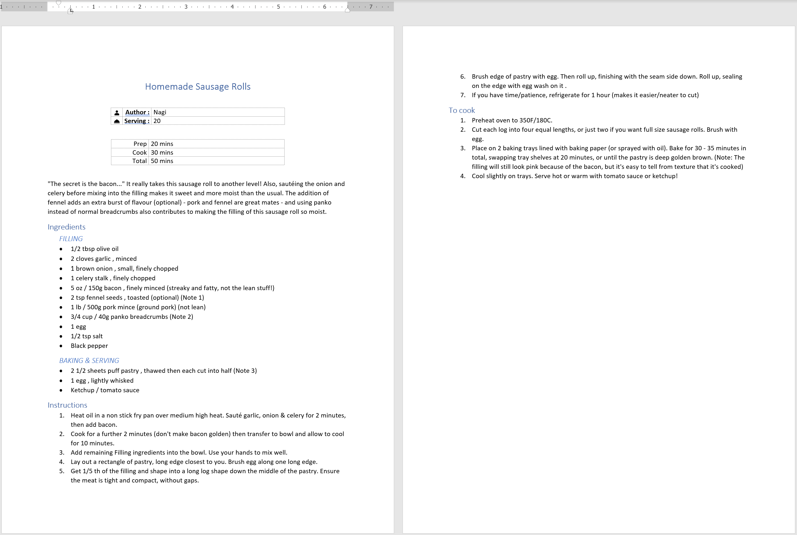

# Gutenberg
The .NET package report builder for generate Microsoft Word docuement with key-value replacement.

# Concept
By inject values with the keys that represent in the MS Word document as a template, 
Gutenberg will generate the complete & beautiful WYSIWYG Word document for you.

* ## Diagram
    

# Usage
* ## To prepare MS Word template (.docx)
  ### 1. Prepare the MS Word template with the format as you need.
  ### 2. Declare `{DOCVAR [variable name]}` at places in the document that you need to replace with the value by the key is `[variable name]`.

  

* ## To inject the key-value into the document
    ### 1. Declare `ReportGenerator` object with template file.
    ```c#
    var template = @"\resources\RecipeTemplate.docx";
    var report = new ReportGenerator(template);
    ```

    ### 2. Set the key-value items with 2 options
    * 2.1. via Methods
        * report.setParagraph(**string** `key`, **string** `value` : Replace paragraph at `{DOCVARIAVBLE key}` with `value`
            * Template

                

                
            * C# Code
                ```c#
                report.setParagraph("Content.Recipe.Name", "Homemade Sausage Rolls");
                report.setParagraph("Content.Summary.Author", "Nagi");
                report.setParagraph("Content.Summary.Serving", "20");
                report.setParagraph("Content.Recipe.Description", "\"The secret is the bacon...\" It really takes this sausage roll to another level! Also, sautéing the onion and celery before mixing into the filling makes it sweet and more moist than the usual. The addition of fennel adds an extra burst of flavour (optional) - pork and fennel are great mates - and using panko instead of normal breadcrumbs also contributes to making the filling of this sausage roll so moist.");
                ```
            * Result

                

        * report.setParagraphs(**string** `key`, **string[]** `values`) : Replace list content (bullets/numbers/etc...) of paragraph at `{DOCVARIAVBLE key}` with `values`
            * Template

                
            * C# Code
                ```c#
                report.setParagraph("Content.Recipe.Filling", new string[] {
                    "1/2 tbsp olive oil", 
                    "2 cloves garlic , minced",
                    "1 brown onion , small, finely chopped",
                    "1 celery stalk , finely chopped",
                    "5 oz / 150g bacon , finely minced (streaky and fatty, not the lean stuff!)",
                    "2 tsp fennel seeds , toasted (optional) (Note 1)",
                    "1 lb / 500g pork mince (ground pork) (not lean)",
                    "3/4 cup / 40g panko breadcrumbs (Note 2)",
                    "1 egg",
                    "1/2 tsp salt",
                    "Black pepper"
                });
                report.setParagraph("Content.Recipe.Bakings", new string[] {
                    "2 1/2 sheets puff pastry , thawed then each cut into half (Note 3)",
                    "1 egg , lightly whisked",
                    "Ketchup / tomato sauce"
                });
                report.setParagraph("Content.Recipe.Instructions", new string[] {
                    "Heat oil in a non stick fry pan over medium high heat. Sauté garlic, onion & celery for 2 minutes, then add bacon.",
                    "Cook for a further 2 minutes (don't make bacon golden) then transfer to bowl and allow to cool for 10 minutes.",
                    "Add remaining Filling ingredients into the bowl. Use your hands to mix well.",
                    "Lay out a rectangle of pastry, long edge closest to you. Brush egg along one long edge.",
                    "Get 1/5 th of the filling and shape into a long log shape down the middle of the pastry. Ensure the meat is tight and compact, without gaps.",
                    "Brush edge of pastry with egg. Then roll up, finishing with the seam side down.\nRoll up, sealing on the edge with egg wash on it .",
                    "If you have time/patience, refrigerate for 1 hour (makes it easier/neater to cut)"
                });
                report.setParagraph("Content.Recipe.Cooks", new string[] {
                    "Preheat oven to 350F/180C.",
                    "Cut each log into four equal lengths, or just two if you want full size sausage rolls. Brush with egg.",
                    "Place on 2 baking trays lined with baking paper (or sprayed with oil). Bake for 30 - 35 minutes in total, swapping tray shelves at 20 minutes, or until the pastry is deep golden brown. (Note: The filling will still look pink because of the bacon, but it's easy to tell from texture that it's cooked)",
                    "Cool slightly on trays. Serve hot or warm with tomato sauce or ketchup!"
                });
                ```
            * Result

                

        * report.setTableParagraph(**string** `key`, **string[][]** `values`) : Replace table content of paragraph at `{DOCVARIAVBLE key}` with `values`
            * Template

                
            * C# Code
                ```c#
                report.setTableParagraph("Content.Times", new string[][] {
                    new string[] { "Prep :", "20 mins" },
                    new string[] { "Cook :", "30 mins" },
                    new string[] { "Total :", "50 mins" }
                });
                ```
            * Result
            
                

    * 2.2. with JSON Data
        * Require package : `Newtonsoft.Json` version `>=11.0.2`
        * `RecipeSource.json`
            ```json
            {
                "Content": {
                    "Summary": {
                        "Author": "Nagi",
                        "Serving": "20"
                    },
                    "Times": [
                        [ "Prep", "20 mins" ],
                        [ "Cook", "30 mins" ],
                        [ "Total", "50 mins" ]
                    ],
                    "Recipe": {
                        "Name": "Homemade Sausage Rolls",
                        "Description": "\"The secret is the bacon...\" It really takes this sausage roll to another level! Also, sautéing the onion and celery before mixing into the filling makes it sweet and more moist than the usual. The addition of fennel adds an extra burst of flavour (optional) - pork and fennel are great mates - and using panko instead of normal breadcrumbs also contributes to making the filling of this sausage roll so moist.",
                        "Filling": [
                            "1/2 tbsp olive oil", 
                            "2 cloves garlic , minced",
                            "1 brown onion , small, finely chopped",
                            "1 celery stalk , finely chopped",
                            "5 oz / 150g bacon , finely minced (streaky and fatty, not the lean stuff!)",
                            "2 tsp fennel seeds , toasted (optional) (Note 1)",
                            "1 lb / 500g pork mince (ground pork) (not lean)",
                            "3/4 cup / 40g panko breadcrumbs (Note 2)",
                            "1 egg",
                            "1/2 tsp salt",
                            "Black pepper"
                        ],
                        "Bakings": [
                            "2 1/2 sheets puff pastry , thawed then each cut into half (Note 3)",
                            "1 egg , lightly whisked",
                            "Ketchup / tomato sauce"
                        ],
                        "Instructions": [
                            "Heat oil in a non stick fry pan over medium high heat. Sauté garlic, onion & celery for 2 minutes, then add bacon.",
                            "Cook for a further 2 minutes (don't make bacon golden) then transfer to bowl and allow to cool for 10 minutes.",
                            "Add remaining Filling ingredients into the bowl. Use your hands to mix well.",
                            "Lay out a rectangle of pastry, long edge closest to you. Brush egg along one long edge.",
                            "Get 1/5 th of the filling and shape into a long log shape down the middle of the pastry. Ensure the meat is tight and compact, without gaps.",
                            "Brush edge of pastry with egg. Then roll up, finishing with the seam side down.\nRoll up, sealing on the edge with egg wash on it .",
                            "If you have time/patience, refrigerate for 1 hour (makes it easier/neater to cut)"
                        ],
                        "Cooks": [
                            "Preheat oven to 350F/180C.",
                            "Cut each log into four equal lengths, or just two if you want full size sausage rolls. Brush with egg.",
                            "Place on 2 baking trays lined with baking paper (or sprayed with oil). Bake for 30 - 35 minutes in total, swapping tray shelves at 20 minutes, or until the pastry is deep golden brown. (Note: The filling will still look pink because of the bacon, but it's easy to tell from texture that it's cooked)",
                            "Cool slightly on trays. Serve hot or warm with tomato sauce or ketchup!"
                        ]
                    }
                }
            }
            ```
        * C# Code
            ```c#
            var source = @"\resources\RecipeSource.json";
            var json = JObject.Parse(File.ReadAllText(source));
            report.setJsonObject(json);
            ```
        * Result
        
            

    ### 3. Produce `docx` report as output file
    ```c#
    var output = @"\RecipeSample.docx";
    report.GenerateToFile(output);
    ```